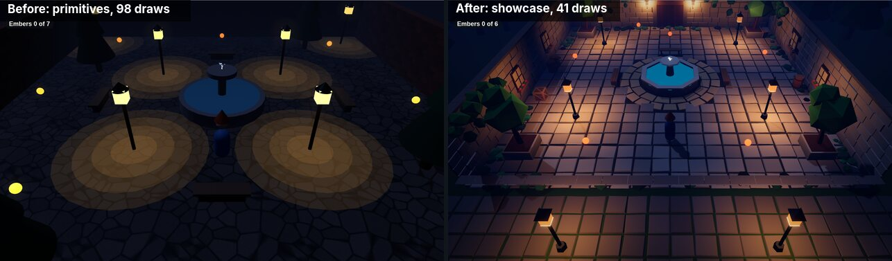
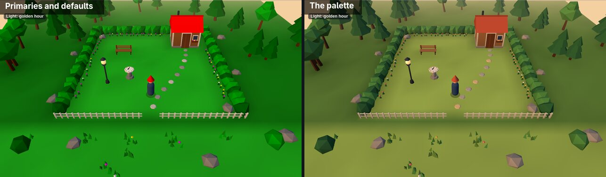
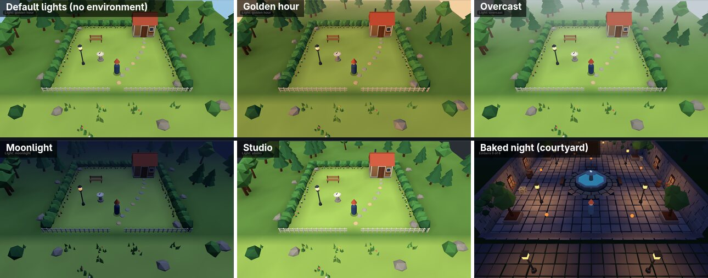
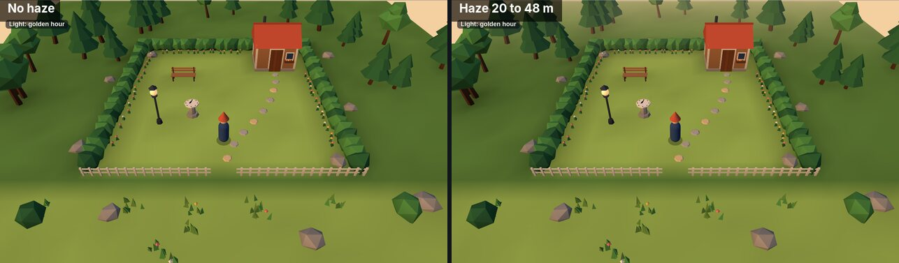
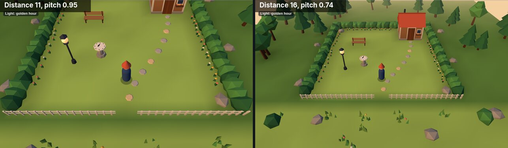
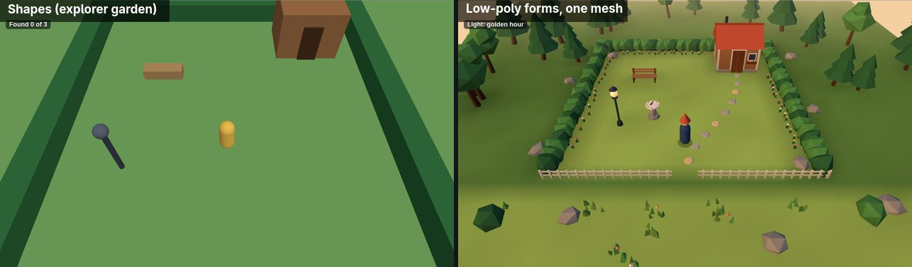
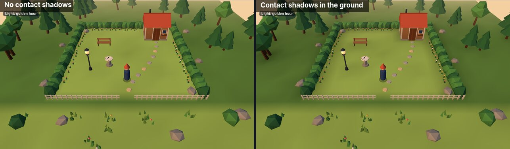
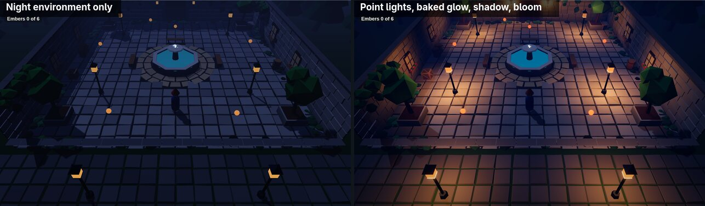
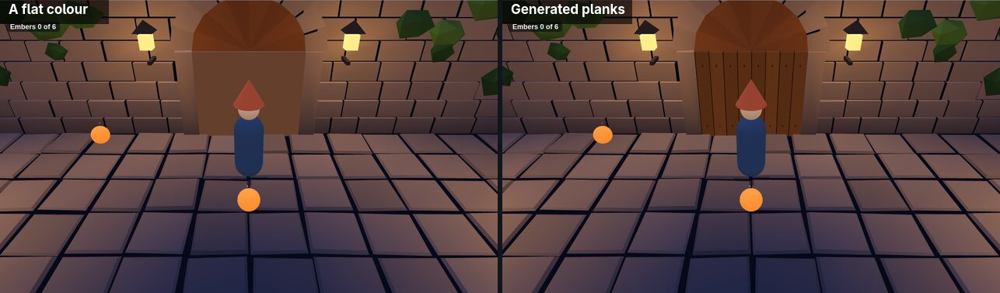
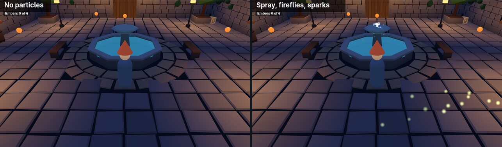

# Recipe: make it look good (art direction)

A scene made of default-coloured boxes under default light looks like programmer art, however good the game is. This
recipe gets a good-looking picture out of the author API: a limited palette, environment presets with gradient skies,
haze, a framed camera, low-poly forms built from vertices, tone mapping, point and spot lights, shadows, light baked
into vertex colours, scatter for repeated things, generated textures and particles. Then it checks the picture against
a short look checklist. All of it is `@engine` data; game code never imports three.js.

Every snippet here is an excerpt of the [`showcase` template](../../templates/showcase/README.md), which is compiled,
tested and gated like every template (`scripts/docs/art-direction-recipe.test.ts` checks that the excerpts still match).
To start from it: `npm run new-game -- --template showcase`. To use the techniques in another game, copy
`game/look.ts` and `game/forms.ts` from it into your `game/` folder.



*Left: a night courtyard built from primitives, an environment and emissive materials, 98 draws. Right: the showcase
courtyard built with this recipe: baked low-poly stonework, point-lit lanterns, one shadowed night light, a gradient sky
a moss scatter and bloom, 41 draws.*

## 0. The loop

1. Say the look in one sentence: time of day, mood, two or three hues. "A lantern-lit stone courtyard at night: cold
   blue stone, warm orange light, one teal fountain."
2. Change one thing at a time.
3. `npm run play:snap -- --scene <id> --mobile`, then open both screenshots and run the [look checklist](#9-the-look-checklist).
4. Read draws and triangles from the same run, against the scene's budget.

## 1. A limited palette

Pick colours once, in one file, and use only those. A few hues, each with a light and a dark step, and one warm accent
for what the player should notice. Avoid pure primaries (`0xff0000`, `0x00ff00`) and default grey: they look like
placeholders.

```ts
// game/look.ts (excerpt)
/** Few hues, each with a light and a dark step, and one warm accent for what the player should notice. */
export const palette = {
  grass: 0xa6cc5c,
  grassDark: 0x5f8c3e,
  leaf: 0x4f8f45,
  leafDark: 0x2f6338,
  wood: 0xb07a4c,
  woodDark: 0x5e3b26,
  roof: 0xc4563c,
  stone: 0xb3aca0,
  stoneDark: 0x6f6a66,
  path: 0xe0c08e,
  iron: 0x3a3f4a,
  ink: 0x3f5f96,
  water: 0x3f8fb0,
  cream: 0xf5ecd9,
  bloom: 0xf07a6a,
  accent: 0xf2c14e,
  lantern: 0xffb45a,
} as const;
```

Scenes import it (`import {palette as P} from './look'`) and write `P.leaf`, never a loose hex number. Then changing the
whole game's key is one edit.



## 2. Light: four presets to copy

`defineEnvironment` sets the background, an optional gradient `sky` (top, horizon and bottom colours, with optional
`discs` for a sun and `stars`), a hemisphere fill (`ambient`: sky colour above, ground colour below), one
directional key light (`directional`, coming *from* `position`), and haze (`color: 'sky'` takes the sky's horizon
colour, so the world's edge melts into it). These four cover most moods; copy them into
`game/look.ts` and adjust.

```ts
// game/look.ts (excerpt)
/** Late-afternoon sun: low, warm key light against a cool sky fill; a gradient sky, and haze in its horizon colour
 *  swallows the distance. */
export const goldenHour = defineEnvironment({
  background: 0xf4cfa0,
  sky: {kind: 'gradient', top: 0x7fa6d6, horizon: 0xf4cfa0, bottom: 0xb9a27a, exponent: 0.7},
  ambient: {sky: 0xa8c0e8, ground: 0x6b5638, intensity: 1.6},
  directional: {color: 0xffc47e, intensity: 3.4, position: [-7, 5, 5]},
  haze: {color: 'sky', near: 20, far: 48},
  points: [],
  pointSize: 1,
});

/** Flat, soft, even light: a cloudy day. Little sun, a strong sky fill, grey-blue haze close in. */
export const overcast = defineEnvironment({
  background: 0xc5ced4,
  sky: {kind: 'gradient', top: 0x9aa8b4, horizon: 0xc5ced4, bottom: 0x8a8f86},
  ambient: {sky: 0xe8eef2, ground: 0x8a8f86, intensity: 2.6},
  directional: {color: 0xf2f4f7, intensity: 0.9, position: [2, 10, 3]},
  haze: {color: 'sky', near: 14, far: 40},
  points: [],
  pointSize: 1,
});

/** Night: a cold, dim key light, deep blue fill, a starry gradient sky and haze in its horizon colour. Keep what matters
 *  bright. */
export const moonlight = defineEnvironment({
  background: 0x0f1834,
  sky: {
    kind: 'gradient',
    top: 0x050a1f,
    horizon: 0x1b2550,
    bottom: 0x0f1834,
    exponent: 0.6,
    stars: {count: 300, seed: 3},
  },
  ambient: {sky: 0x5a6fae, ground: 0x1a1d2a, intensity: 1.5},
  directional: {color: 0xaec4ff, intensity: 1.6, position: [5, 8, -4]},
  haze: {color: 'sky', near: 14, far: 36},
  points: [],
  pointSize: 1,
});

/** A neutral studio: white key light from the front left, even fill, no haze. For checking forms and colours. */
export const studio = defineEnvironment({
  background: 0x2a2e35,
  ambient: {sky: 0xffffff, ground: 0x4a4640, intensity: 1.8},
  directional: {color: 0xffffff, intensity: 2.4, position: [-3, 6, 5]},
  haze: null,
  points: [],
  pointSize: 1,
});
```

Use one in a scene with `view: {background: goldenHour.background, environment: goldenHour}`, or switch at run time by
assigning `ctx.view.environment = overcast` (the garden's sundial does this in the template).



**Lighting ratios.** Without tone mapping (the default, `view.output` unset) the numbers are close to literal:

- A surface's drawn colour is roughly its colour × (fill + key × how squarely it faces the key) ÷ π. For daylight,
  keep `ambient.intensity + directional.intensity × (height of the sun)` near **3** (π): a surface facing the sun then
  shows its own palette colour. Below about 2 reads as dusk; above about 4 washes out, because colours clip at white.
  "Height of the sun" is `position[1]` divided by the length of `position`: 0.5 in golden hour.
- **Key to fill**: about 2 : 1 for a sunny look (golden hour: 3.4 : 1.6), about 1 : 3 for overcast (soft, almost no
  facets), about 1 : 1 and both dim for night.
- **Warm key, cool fill** (or the reverse at night). The contrast between them is what makes faces read.
- **A low sun from the side** (`position` with y about half the horizontal distance, x not zero) gives every form a lit
  side and a shaded side. A sun straight overhead or straight behind the camera flattens everything.
- Keep the haze in the sky's colour (`color: 'sky'`), so the world's edge melts into the sky.
- **Tone mapping** (`view: {output: {toneMapping: 'aces', exposure: 1.1}}`) rolls bright light off instead of clipping
  it, which a scene with point lights needs. It also desaturates: mid-tones get a little darker and strong glows turn
  towards white. A daylight scene without bright lights can leave it off and keep its palette exact; a night scene
  with lamps should turn it on and compare the pictures.

## 3. Haze for depth

`haze: {color, near, far}` fades everything between `near` and `far` metres from the camera into `color`. Haze makes
distance visible: layers of trees and roofs that grow paler with distance read as depth.

- Put `near` just beyond the play area's nearest edge seen from the camera, so the playable part stays crisp.
- Put `far` before the ground runs out, so nobody sees the world's edge. In the template the orbit camera is 16 m away,
  so golden hour uses `near: 20, far: 48` and the ground is 40 m wide.
- Use the background colour as the haze colour.



## 4. Compose with the camera

- **Frame the world, not the floor.** A camera looking almost straight down shows a floor plan. A lower pitch and a
  longer distance show walls, silhouettes and the haze behind them.
- **Start where the camera will settle.** Set the scene's `view.camera` to the pose the camera system will ease to, or
  the first screenshot (and the first second of play) shows it swinging round to its pose. For `orbit`, the position is the
  target plus `distance × (0, sin(pitch), cos(pitch))`.
- **Phones.** `minWidthFov` widens a portrait view so the play area still fits. Fill the extra height with something
  worth seeing in front of the play area (a street, a meadow, a low hedge), not empty ground.
- **Frame the edges.** Something dark or tall at the corners (a tree, a lamp post) frames the lit centre.

```ts
// game/world.ts (excerpt)
  cameraSystem('orbit', {distance: 16, pitch: 0.74, yaw: 0, smooth: 0.15}),
```

```ts
// game/garden.ts (excerpt)
    camera: {position: [0, 11.5, 16.4], target: [0, 0.7, 4.6], fov: 50, minWidthFov: 55},
```



## 5. Forms: build from vertices, not boxes

A `Shape` is a box, sphere, cylinder, cone, capsule or plane; a world made of them looks like a diagram. `defineMesh`
takes your own vertices and per-vertex colours, so a game can build its own forms: rocks, bushes, trees, crystals,
walls of stone blocks, roofs. The template's `game/forms.ts` is a small set of builders that add faceted triangles to
a **bake**, then turn the whole bake into **one** `Mesh`:

- `rock` (a jittered icosahedron, 20 triangles; with a leaf colour it is a bush), `tree` (pine or round), `crystal`,
  `prism` (any frustum or cone), `ring` (a basin or rim), `box`, `roof`, `ground` (a coloured grid), and `face` (any
  flat polygon) underneath them all;
- every triangle owns its three vertices, so each face is lit on its own: the faceted low-poly look;
- every builder takes a `seed`, so the same scenery comes back every run (no `Math.random()`);
- faces near `y = 0` are darkened a little: ambient occlusion baked into the colours at no cost.

```ts
// game/forms.ts (excerpt)
/** A rock (or, with a leaf colour, a bush): a jittered icosahedron, squashed, sitting at `at`. 20 triangles. */
export function rock(b: Bake, o: {at: V3; size: number; seed: string; color: number; squash?: number}): void {
  const r = createSaveableRng(o.seed),
    squash = o.squash ?? 0.6;
  const v = ICO_V.map(([x, y, z]): V3 => {
    const s = o.size * r.range(0.78, 1.15);
    return [o.at[0] + x * s, o.at[1] + y * s * squash, o.at[2] + z * s];
  });
  for (const [i, j, k] of ICO_F) face(b, [v[i]!, v[j]!, v[k]!], o.color, r.range(0.9, 1.08), o.at);
}
```

Use them in a helper that builds the scenery once, and give the scene one entity per bake. A hedge is a row of bushes;
the garden's whole scenery, with the shed, bench, fence and every tree beyond the hedge, is one draw:

```ts
// game/garden-scenery.ts (excerpt)
export function gardenScenery() {
  const b = bake();
  // Hedges: a row of leafy blobs along each Solid hedge.
  const hedge = (x0: number, z0: number, x1: number, z1: number, id: string) => {
    const n = Math.round(Math.hypot(x1 - x0, z1 - z0) / 0.62);
    for (let i = 0; i <= n; i++)
      rock(b, {
        at: [x0 + ((x1 - x0) * i) / n, 0.45, z0 + ((z1 - z0) * i) / n],
        size: 0.66,
        squash: 0.95,
        seed: `hedge/${id}/${i}`,
        color: i % 3 ? P.leaf : P.leafDark,
      });
  };
```

```ts
// game/garden.ts (excerpt)
    [Name({name: 'scenery'}), Transform(), gardenScenery()],
```

Collision is separate: keep `Solid` and `Walls` entities where the player must stop, as before. A `Mesh` only draws.

- **Detail where the eye goes.** Clumps of grass read as texture; single scattered blades read as noise.
- **Vary scale and shade** a little per piece (`r.range(0.9, 1.08)`), never per frame.
- **Materials:** a `Mesh` takes a `Material` (shading `'flat'`, `'matte'` or `'toon'`, emission, transparency) but
  no texture (it has no texture coordinates); put textures on `Shape`s. A bake is static once built: rebuild it, or
  bump its `revision`, only when the scenery changes.
- **Many copies of one thing** (moss, grass, pickets, hedge blobs) are a `Scatter`: one small mesh, copied with
  seeded positions, scale, turn and colour jitter, in one draw ([scatter grass and rocks](scatter-grass-and-rocks.md)).
  The courtyard's moss:

```ts
// game/courtyard.ts (excerpt)
      defineScatter({
        mesh: blobMesh(0.32, 0.5),
        area: {kind: 'edge', rect: [-HALF + 0.1, -HALF + 0.1, HALF - 0.1, HALF - 0.1], width: 0.7},
        count: 160,
        seed: 5,
        y: 0.04,
        scale: [0.5, 1.4],
        ry: 'random',
        color: P.leafDark,
        colorJitter: [0.02, 0.06, 0.08],
      }),
      defineMaterial({shading: 'flat'}),
```

  A scatter's triangles are its copies times one copy's: keep the copied mesh small (`blobMesh` is 20 triangles).
  Copies cast no shadows, and lighter quality presets draw fewer of them unless `essential: true` (use that for things
  whose gaps would show, like a hedge).



## 6. Light and shadow: real where it matters, baked for the rest

The engine has point and spot lights, shadows and tone mapping, all opt-in per scene
([scene look guide](../guides/scene-look.md)). They cost per pixel, per slot and per shadow map, so a good-looking
scene that still runs on a phone mixes them with light baked into vertex colours.

**The rule:**

1. **The environment holds the darkness.** Night is a dim, cool `ambient` and a weak key, with the scene's colours
   left at their palette values. (If darkness is baked into the colours instead, a real light can only light a dark
   surface, and the picture comes out near black.)
2. **Real lights for what the player sees light up.** A `PointLight` or `SpotLight` on each lamp near the action, in a
   scene with `lights: sceneLights({point: n})`. Slots are fixed per visit; the `low` preset admits 2 of each kind
   (`essential: true` ones first).
3. **Bake the rest.** `bakeLight` adds static light to a bake's vertex colours for free: a faint glow round every lamp
   (so a lamp whose real light was refused on a light preset still lights its surroundings a little), lit windows,
   glowing water. Bake with a white ambient (`0xffffff`), so it only adds light.
4. **One shadowed light.** Give the sun (by night, the cold key light) the shadow (`directional: {…, shadow: {extent}}` and
   `shadows: sceneShadows()`), and leave lamps unshadowed or baked.
5. **Tone mapping on** (`'aces'`, exposure about 1.1) once there are point lights, and keep glass emissive near 1.

```ts
// game/look.ts (excerpt)
export const lanternNight = defineEnvironment({
  background: 0x0a1028,
  sky: {
    kind: 'gradient',
    top: 0x03061a,
    horizon: 0x1f2a5a,
    bottom: 0x0a1028,
    exponent: 0.6,
    discs: [{direction: [-0.45, 0.5, -0.75], size: 4, color: 0xe6ecff, glow: 0.5}],
    stars: {count: 400, seed: 7},
  },
  ambient: {sky: 0x5a6fae, ground: 0x2a2433, intensity: 0.5},
  directional: {color: 0xa8bcff, intensity: 0.7, position: [-4, 8, -6], shadow: {extent: 13}},
  haze: {kind: 'exp2', color: 'sky', density: 0.028},
  points: [],
  pointSize: 1,
});
```

```ts
// game/courtyard.ts (excerpt)
const glass = (x: number, y: number, z: number, size: number, intensity: number) => [
  Transform({x, y, z}),
  Shape({kind: 'box', size: [size, size * 1.2, size], color: 0xff9a40}),
  defineMaterial({emissive: 0xff8a30, emissiveIntensity: 1}),
  PointLight({color: P.lantern, intensity, distance: 6.5, decay: 2}),
  Shadow({cast: false}),
];
// …
    output: {toneMapping: 'aces', exposure: 1.1},
// …
  lights: sceneLights({point: 8}),
  shadows: sceneShadows(),
```

```ts
// game/courtyard-scenery.ts (excerpt)
export const LIGHTS: BakedLight[] = [
  ...[...POSTS, ...STREET_LAMPS].map(([x, z]): BakedLight => ({
    at: [x, LANTERN_Y, z],
    color: P.lantern,
    intensity: 0.5,
    range: 4,
  })),
// …
  // A faint glow round every lamp, the water and the windows, on top of the stone's own colours (white: no darkening).
  bakeLight(b, 0xffffff, LIGHTS);
```

**Emissive.** An emissive material lights nothing; it only makes the surface bright. Keep `emissiveIntensity` about 1
for coloured glass and embers. With tone mapping, 2 to 6 washes the colour out towards white (tone mapping
desaturates strong glows); without it, anything above about 1 clips to a flat patch. A glow reads as light only when
something next to it is lit: put a light (real or baked) at every glowing thing.

**Bloom** spreads the brightest pixels into a halo, so glass reads as a light source. Ask for it with `view.post`
([post-processing](../guides/post-processing.md)); the player's quality setting decides how much runs (`full`: bloom,
vignette and grade, 10 fullscreen passes counted as `postDraws`; `basic`: vignette and grade, 1 pass; `off` on `low`).
With bloom, keep the emissive near 1 and lower the bloom `threshold` below 1 instead of pushing the glow:

```ts
// game/courtyard.ts (excerpt)
    post: {
      bloom: {strength: 0.8, threshold: 0.85, radius: 0.55},
      vignette: {amount: 0.35},
      grade: {lift: [0, 0.004, 0.02], gain: [1.04, 1, 0.96], saturation: 1.05},
    },
```

Post renders the scene into a half-float target first: at 1280×800 that and the bloom mips added about 10 MiB of
textures to the courtyard. On phones prefer `basic` (vignette and grade) or none.

**What shadows and sky cost** (measured on software GL at the reference preset):

| Feature | Draws | Texture memory |
|---|---|---|
| Sun shadow (`directional.shadow`) | one extra pass: +1 draw per shadow-casting entity | the 2048 map, about **32 MiB** (1024 on `low`, about 8 MiB) |
| A shadowed point light | about **6 extra scene passes** (one per cube face), about 18 extra draws in a small scene | 512 per face |
| A shadowed spot light | one extra pass | 1024 at reference |
| Gradient sky | +1 draw (+1 more with `stars`) | 1 KiB, or 512 KiB with `discs` |
| Post (`view.post`) at `full` | +10 fullscreen passes (`postDraws`, counted apart from `draws`) | the scene target and bloom mips, about 10 MiB at 1280×800 |
| Point or spot light without shadow | none | none (fragment cost on every lit pixel) |

A trial scene with a shadowed sun and lamps measured 32.5 MiB of textures against an 8 MiB budget. On phones, use
**one shadowed sun (or night key light)**, with baked or unshadowed fill lights; mark small or always-moving things
`Shadow({cast: false})` (they would redraw the maps every frame), and floors too (they only receive). The showcase
courtyard splits its stonework into a ground mesh that casts nothing and a standing mesh that casts.

**Contact shadows without a shadow map.** Where a scene cannot afford a map (a phone budget of 8 MiB textures), darken
the ground right against everything that stands on it, per vertex, and put a see-through disc under moving things:

```ts
// game/garden-scenery.ts (excerpt)
  // Contact shadows: darker grass right against everything that stands on it.
  let shade = 1;
  for (const [x0, x1, z0, z1] of BLOCKS) shade *= 1 - 0.45 * Math.exp(-toRect(x, z, x0, x1, z0, z1) / 0.7);
  for (const t of TREES) shade *= 1 - 0.4 * Math.exp(-Math.hypot(x - t.at[0], z - t.at[2]) / (t.height * 0.25));
```



```ts
// game/world.ts (excerpt)
        [
          Transform({x, y: 0.015, z}),
          Shape({kind: 'cylinder', size: [0.85, 0.01, 0.85], color: shadow}),
          defineMaterial({opacity: 0.4, transparent: true}),
          Follow({dy: -0.685}),
        ],
```



## 7. Textures, generated in `game/tools`

A texture breaks up a flat colour on a shape (doors, crates, floors). Paint it with a build-time script instead of
downloading artwork: it is original, licensed by you, small and reproducible. The template's
`game/tools/generate-textures.mjs` has a tiny PNG writer (`png(name, size, paint)`, Node built-ins only) and painters
for planks and a crate:

```js
// game/tools/generate-textures.mjs (excerpt)
/** Wood: four vertical boards per tile, each its own shade, with grain streaks, dark seams and two nails. */
function wood(x, y, size, base) {
  const boards = 4,
    w = size / boards,
    board = Math.floor(x / w),
    u = x - board * w;
  const shade = 0.86 + 0.2 * hash(board, 7, 1);
  const grain = 0.93 + 0.07 * Math.sin((x * 0.9 + Math.sin(y * 0.05 + board) * 3) * 1.7) + 0.05 * (hash(x, y) - 0.5);
  let k = shade * grain;
  if (u < 1.5 || u > w - 1) k *= 0.45; // the seam between boards
  for (const ny of [size * 0.14, size * 0.86]) if (Math.hypot(u - w / 2, y - ny) < 1.8) k *= 0.5; // nails
  return base.map(v => v * k);
}

const WOOD = [196, 148, 104];
png('planks.png', 128, (x, y) => wood(x, y, 128, WOOD));
```

Run it with `node game/tools/generate-textures.mjs`, declare each file as an asset, and give a shape a material:

```ts
// game/planks.asset.ts
// A texture the game ships, painted by tools/generate-textures.mjs into public/textures/showcase/.
import {defineAsset} from '@engine';

export default defineAsset({
  id: 'planks',
  type: 'texture',
  url: '/textures/showcase/planks.png',
  width: 128,
  height: 128,
  licence: 'CC0-1.0',
  author: 'Foundation Engine contributors',
  source: 'templates/showcase/game/tools/generate-textures.mjs',
});
```

```ts
// game/courtyard.ts (excerpt)
      Shape({kind: 'box', size: [2.6, 2.2, 0.1], color: 0xb08260}),
      defineMaterial({texture: 'planks', repeat: [2, 1], roughness: 0.9}),
```

The shape's colour tints the texture: paint textures in light, fairly neutral tones and pick the tint from the palette.
Keep them small (128 px here); more in [give a shape a material](give-a-shape-a-material.md).



## 8. Particles for life

A still picture of a still world looks dead. A few particles make it breathe: motes or fireflies drifting in the
light, spray on a fountain, sparks when something is taken. Each emitter is one draw. Motes from a single point
cluster, so the template moves one emitter slowly round a loop (and holds it still under Calm, reduced motion):

```ts
// game/world.ts (excerpt)
/** Moves the motes' source on a slow loop around (x, z), `rx` by `rz` metres. Decoration: it stays put under Calm. */
export const wanderMotes = (x: number, z: number, rx: number, rz: number) =>
  defineSystem({
    id: 'wander-motes',
    phase: 'frame',
    run(ctx) {
      const e = ctx.named('motes'),
        tr = e === undefined ? undefined : ctx.world.get(e, Transform);
      if (!tr || ctx.time.calm) return;
      const t = ctx.time.t;
      tr.x = x + Math.sin(t * 0.21) * rx + Math.sin(t * 0.53) * 0.4;
      tr.z = z + Math.cos(t * 0.17) * rz;
      tr.y = 0.9 + Math.sin(t * 0.37) * 0.5;
      ctx.world.touch();
    },
  });
```

**Time in a system.** A system's `run(ctx, dt)` receives the step time `dt` in seconds (fixed systems get the fixed
step, frame systems the frame's time); `ctx.time.t` is the seconds since the visit began. There is no `ctx.time.dt`.

Continuous emitters keep the scene redrawing, so keep them few and small. The particle API is in
[hit sparks and pickups](hit-sparks-and-pickups.md).



## 9. The look checklist

Run it on the desktop **and** phone screenshots of `npm run play:snap -- --scene <id> --mobile` after every change.
Look at the pictures yourself; a passing snap is not a good-looking one.

1. **The subject reads in under a second.** The player (and the next thing to do) stands out by value or colour from
   what is around it.
2. **Value contrast.** Squint: foreground, middle and background are different brightnesses, not one even mid-tone.
3. **No placeholder colours.** No default grey, no pure primaries; every colour is from the palette.
4. **Every face shows its form.** Solid things show at least two shades (a lit side and a shaded side). If they look
   flat, move the key light lower and to the side.
5. **Things sit on the ground.** Contact darkening or a shadow disc under everything that stands; nothing floats.
6. **Every glowing thing lights something** (a point light or a baked glow). A glow with nothing lit around it reads
   as paint; a glow washed to white means its `emissiveIntensity` is too high for the tone mapping.
7. **The world has an edge you cannot see.** Haze or framing hides where the ground ends; no seam against the sky.
8. **The phone view works.** The play area fits, the empty space is filled with something, the HUD covers nothing that
   matters, and a dark setup is still readable.
9. **Within budget.** Draws, triangles and texture memory in the snap are inside `budgets.json` (a shadow map is
   texture memory). Static scenery is baked into one mesh per bake; repeated things are a scatter.
10. **Motion is calm.** Nothing flickers or swims; decorative motion stops under Calm.

## What it costs

Measured on software GL at 1280×800 (`npm run bench`); triangles are per frame:

| Scene | Before | After |
|---|---|---|
| Garden | explorer garden: 10 draws, 1 306 triangles | showcase garden (gradient sky, no shadows): 10 draws, 9 676 triangles, 0.1 MiB textures |
| Courtyard | the trial courtyard: 98 draws, 10 488 triangles | showcase courtyard (8 point lights, a shadowed night light, sky, scatter, bloom): 41 draws + 10 post, 27 860 triangles, 42.5 MiB textures |

Part of the courtyard's 41 draws is the shadow pass (one per casting entity), and of its 42.5 MiB of textures, 32
are the shadow map (the single biggest cost in this recipe) and about 10 the post targets. The garden keeps the phone-sized budget (8 MiB) by
using contact darkening instead of a shadow map.

Draws matter more than triangles on phones: baking a hundred rocks into one mesh is one draw. Frame time under
software GL says nothing about a device; measure on the devices the brief targets.

## What is not here yet

Tone mapping, point and spot lights, shadows, gradient skies with discs and stars, exp2 haze, `Material` on a `Mesh`
(flat, matte and toon shading) and instanced scatter are all in the engine now (sections 2, 5 and 6). Still missing,
with today's workaround:

| Missing | Today |
|---|---|
| A texture on a `Mesh` | vertex colours on the mesh; textures on `Shape`s |
| Per-copy motion in a scatter (grass sway) | static copies; particles for small moving things |
| Scattering a glTF `Model` | bake it into a `Mesh`, or scatter a `Mesh` |
| Scatter copies as shadow casters (scenes with `sceneShadows()` still shadow other things) | contact darkening baked into the ground under them |

When one of these lands in the engine, this recipe gains a section for it.

## When the author API cannot express the look: three.js itself

Prefer the techniques above while they can say what you want: they keep quality tiers, budgets and three.js upgrades
the engine's problem. When they cannot (bloom or another EffectComposer pass, a custom shader, a loader or controls), a
game can opt into `@kits/three` and use three.js directly: full power, and the game owns that code across three.js
upgrades. See [use three.js directly](use-three-directly.md).
